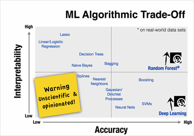
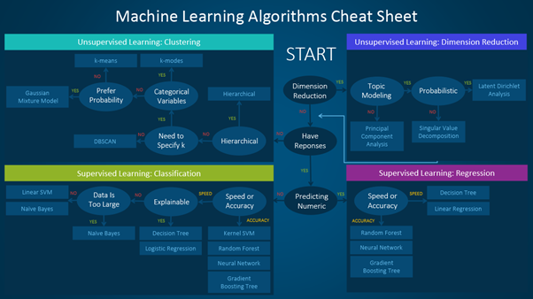

<link rel="stylesheet" href="../../stylesheet.css">

## Guide to choose the right ML algorithm

### Size of the Training Data
> It is usually recommended to gather a good amount of data to get reliable predictions. However, many a time, the availability of data is a constraint. So, if the training data is smaller or if the dataset has a fewer number of observations and a higher number of features like genetics or textual data, choose algorithms with high bias/low variance like **Linear Regression**, **Naïve Bayes**, or **Linear SVM**.
> If the training data is sufficiently large and the number of observations is higher as compared to the number of features, one can go for low bias/high variance algorithms like KNN, Decision trees, or kernel SVM.

### Accuracy and/or Interpretability of the Output
> Accuracy of a model means that the function predicts a response value for a given observation, which is close to the true response value for that observation. A highly interpretable algorithm (restrictive models like **Linear Regression**) means that one can easily understand how any individual predictor is associated with the response while the flexible models give higher accuracy at the cost of low interpretability.

- *Some algorithms are called **restrictive** because they produce a **small range of shapes** of the mapping function — for example, linear regression is a restrictive approach because it can only generate linear functions such as the lines.*
- *Some algorithms are called **flexible** because they can generate a **wider range of possible shapes** of the mapping function — for example, KNN with $k=1$ is highly flexible as it will consider every input data point to generate the mapping output function.*

### Speed or Training Time
> Algorithms like Naïve Bayes and Linear and Logistic regression are easy to implement and quick to run. Algorithms like SVM, which involve tuning of parameters, Neural networks with high convergence time, and random forests, need a lot of time to train the data.

### Linearity
> Many algorithms work on the assumption that classes can be separated by a straight line (or its higher-dimensional analog). However, not always is the data is linear, so we require other algorithms which can handle high dimensional and complex data structures. Examples include **kernel SVM**, **random forest**, **neural nets**.

### Number of Features
> A large number of features can bog down some learning algorithms, making training time unfeasibly long. SVM is better suited in case of data with large feature space and lesser observations. PCA and feature selection techniques should be used to reduce dimensionality and select important features.

## Choix des bonnes métriques
> L’un des concepts clés de performance pour la classification est la [matrice de confusion](https://en.wikipedia.org/wiki/Confusion_matrix) qui est une visualisation, sous forme de tableau, des prédictions du modèle par rapport aux vrais labels. Chaque ligne de la matrice de confusion représente les instances d’une classe réelles et chaque colonne représente les instances d’une classe prédite.

- (**Precision** $\uparrow$) `&` (**Recall** $\uparrow$) `->` La classe a été bien gérée par le modèle
- (**Precision** $\uparrow$) `&` (**Recall** $\downarrow$) `->` La classe n’est pas bien détectée mais lorsqu’elle l’est, le modèle est très fiable. 
- (**Precision** $\downarrow$) `&` (**Recall** $\uparrow$) `->` La classe est bien détectée, mais inclut également des observations d’autres classes.
- (**Precision** $\downarrow$) `&` (**Recall** $\downarrow$) `->` la classe n’a pas du tout été bien gérée

# Classification

## Régression logistique
- La régression logistique est utilisée pour estimer une valeur discète (**classe** ou **catégorie**).
- La fonction $h$ qui définit la régression logistique s'écrit alors:
$$
    \forall\,\mathcal{X} \in \mathbb{R}^n, \quad h(\mathcal{X}) = \frac{1}{1 + e^{- \Sigma_{i \in I} w_i\,\cdot\,x_i}}
$$

## Confusion Matrix
> Each row of the matrix represents the instances in an actual class while each column represents the instances in a predicted class (*or vice versa*).

# To Classify
- Machine learning algorithms can be divided into [supervised](https://en.wikipedia.org/wiki/Supervised_learning), [unsupervised](https://en.wikipedia.org/wiki/Unsupervised_learning), and [reinforcement learning](https://en.wikipedia.org/wiki/Reinforcement_learning).
- Une métrique d’évaluation quantifie la performance d’un modèle prédictif.