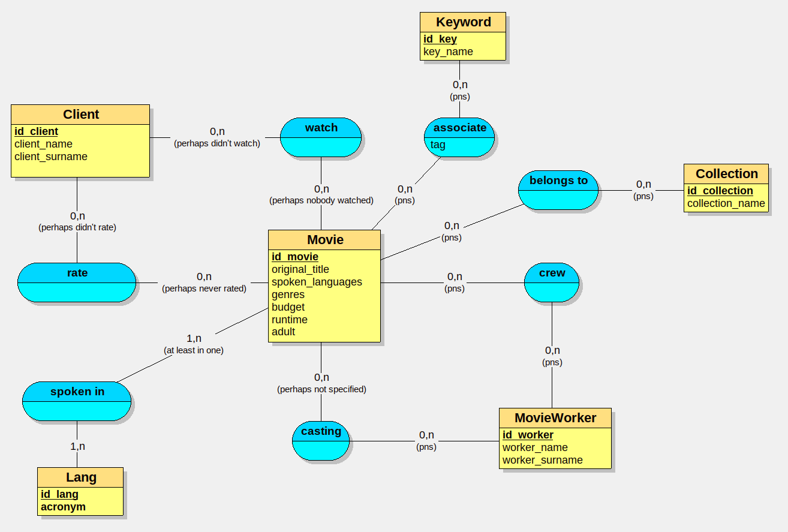

# Merise Workshop

## Dictionnaire de données

### Entités

> **Entité :** Individu \
> **Attributs :**
> - Code (*Clé primaire, Type: `Integer`*)
> - Nom (*Type: `String`*)
> - Prénom (*Type: `String`*)
> 
> **Relations :**
> - XT (*héritage*)

</br>

> **Entité :** Professeur \
> **Attributs :**
> - Compétence (*Type: `String`*)
> 
> **Relations :**
> - XT (*héritage*)
> - Enseigner (*Cardinalité: `0..n`*)

</br>

> **Entité :** Etudiant \
> **Attributs :**
> - Diplome (*Type: `String`*)
> 
> **Relations :**
> - XT (*héritage*)
> - Participer (*Cardinalité: `0..n`*)
> - Habite (*Cardinalité: `1..1`*)

</br>

> **Entité :** Adresse \
> **Attributs :**
> - Numéro (*Clé primaire, Type: `Integer`*)
> - Rue (*Clé primaire, Type: `String`*)
> - Ville (*Clé primaire, Type: `String`*)
> - Code postal (*Clé primaire, Type: `String`*)
> 
> **Relations :**
> - Habite (*Cardinalité: `0..1`*)

</br>

> **Entité :** Cours \
> **Attributs :**
> - Heure de début (*Clé primaire, Type: `Time`*)
> - Heure de fin (*Clé primaire, Type: `Time`*)
> 
> **Relations :**
> - Participer (*Cardinalité: `1..1`*)
> - Enseigner (*Cardinalité: `1..1`*)
> - Occuper (*Cardinalité: `1..1(R)`*)
> - Diviser (*Cardinalité: `1..1`*)

</br>

> **Entité :** Salle \
> **Attributs :**
> - Nom (*Clé primaire, Type: `String`*)
>
> **Relations :** 
> - Occuper (*Cardinalité: `0..n`*)

</br>

> **Entité :** Matière \
> **Attributs :**
> - Nom (*Clé primaire, Type: `String`*)
> 
> **Relations :**
> - Occuper (*Cardinalité: `0..n`*)

## MPD Généré

```sql
CREATE TABLE Individu(
   code INT,
   nom VARCHAR(50),
   prénom VARCHAR(50),
   PRIMARY KEY(code)
);

CREATE TABLE Professeur(
   code INT,
   compétence VARCHAR(50),
   PRIMARY KEY(code),
   FOREIGN KEY(code) REFERENCES Individu(code)
);

CREATE TABLE Adresse(
   numéro VARCHAR(50),
   rue VARCHAR(50),
   ville VARCHAR(50),
   code_postal VARCHAR(50),
   PRIMARY KEY(numéro, rue, ville, code_postal)
);

CREATE TABLE Salle(
   nom VARCHAR(50),
   PRIMARY KEY(nom)
);

CREATE TABLE Matière(
   nom VARCHAR(50),
   PRIMARY KEY(nom)
);

CREATE TABLE Etudiant(
   code INT,
   diplome VARCHAR(50),
   numéro VARCHAR(50) NOT NULL,
   rue VARCHAR(50) NOT NULL,
   ville VARCHAR(50) NOT NULL,
   code_postal VARCHAR(50) NOT NULL,
   PRIMARY KEY(code),
   UNIQUE(numéro, rue, ville, code_postal),
   FOREIGN KEY(code) REFERENCES Individu(code),
   FOREIGN KEY(numéro, rue, ville, code_postal) REFERENCES Adresse(numéro, rue, ville, code_postal)
);

CREATE TABLE Cours(
   nom VARCHAR(50),
   heure_de_début TIME,
   heure_de_fin TIME,
   code INT NOT NULL,
   code_1 INT NOT NULL,
   nom_1 VARCHAR(50) NOT NULL,
   PRIMARY KEY(nom, heure_de_début, heure_de_fin),
   FOREIGN KEY(nom) REFERENCES Salle(nom),
   FOREIGN KEY(code) REFERENCES Etudiant(code),
   FOREIGN KEY(code_1) REFERENCES Professeur(code),
   FOREIGN KEY(nom_1) REFERENCES Matière(nom)
);
```

## Netlix MCD
